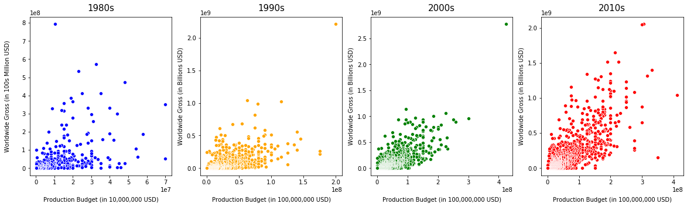
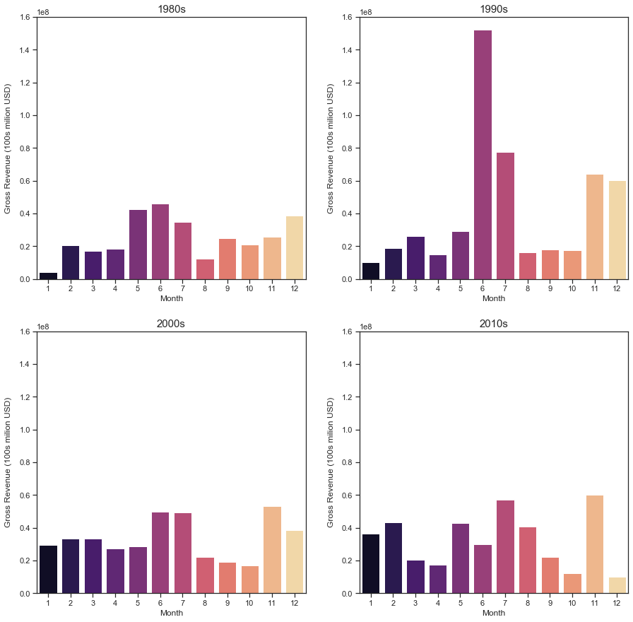
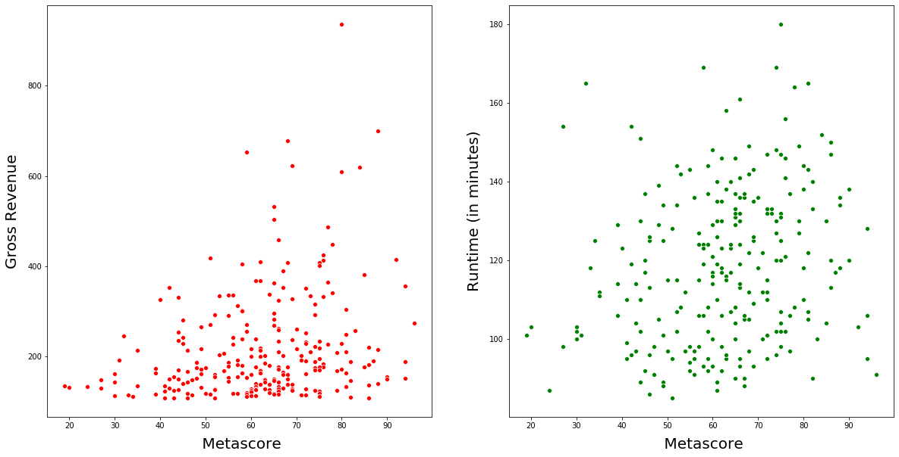

# An Analysis of Movie Success at the Box Office


## Purpose
The purpose of this project is to investigate what has the biggest impact on the success of a movie at the box office. 


## Data Description
The Repo is split up into 4 folders and the main section

```
Main Section - Contains .ipynb files of all questions
* Question 1 - Correlation between Budget and Revenue.ipynb
* Question 2 - Does ROI change based on budget categories.ipynb
* Question 3 - Does the day of the week and month of release affect gross revenue?.ipynb
* Question 4- ROI & Gross Revenue by Genre.ipynb
* Question 5 - Top 250 Grossing films of last decade.ipynb

Cleandata:
* genredf.csv
* movierevenue.csv
* randomgenreallocated.csv
* Revenue_Budget_Genre


Data Cleaning Notebooks:
Contains notebooks where datacleaning was done
* Using TMDB API to get Genre names and also making table.ipynb
* Cleaning Data Movie Revenue.ipynb
* Web Scraping and Cleaning.ipynb

ZippedData:
* bom.movie_gross.csv
* imdb.name.basics.csv
* imdb.title.akas.csv
* imdb.title.basics.csv
* imdb.title.crew.csv.gz
* imdb.title.principals.csv
* imdb.title.ratings.csv.gz
* rt.movie_info 2.tsv
* rt.movie_info.tsv
* rt.movie_info.tsv.gz
* rt.review.tsv
* rt.reviews.csv
* rt.reviews.tsv
* rt.reviews.tsv.gz
* tmdb.movies.csv
* tmdb.movies.csv.gz
* tn.movie_budgets.csv
* tn.movie_budgets.csv.gz

Images:
* Contains array of images that are use in the powerpoint pdf

```


## Question 1: Is there a Correlation between Budget and Revenue?
###### Sub Question - How has this Changed over the decades?

#####Findings:
With a correlation coefficient of 0.75, there is a strong relationship between budget and revenue. It is also interesting to note that this relationship has strengthened throughout the last 4 decades. Going from 0.36 in 1980s to 0.90 in the 2010s!!

#####Recommendations:
Given this information, it is clear that the key is to spend spend spend when it comes to revenue generation is all you are worried about.





## Question 2: Does ROI change as the budget changes?
###### Looking at Budgets under $100 million


#####Findings:
ROI is different depending on budget. Notably, a bigger budget does not always result in a bigger return. 
For Example, the 40-50 million category returns less on average than the 10-20 million category

#####Recommendations:
Look at releasing movies in July and November.

## Question 3: Does the performance of a movie change based on the day/month of release?
###### Looking at median Gross

#####Findings:
The Best Month on average for gross revenue has changed throughout the decades. July has stayed constant in the top 2. Notably, December releases have become less and less profitable.
#####Recommendations:
Focus on Animation, Adventure and Mystery films  as these yield the highest return.
Steer clear of Documentaries, as they are loss making, on average.

 




## Question 4: An Exloration of Genres
#### How do gross revenue and ROI change across genres?

#####Findings:
It is clear from the graph below that ROI varies massively by genre. 

#####Recommendations:
Focus on Animation, Adventure and Mystery films  as these yield the highest return.
Steer clear of Documentaries, as they are loss making, on average.


## Question 5: An Exploration of the Ratings
###### Is there a Correlation between MetaScores, Runtime and IMDB Ratings?

##### Findings:
We found that runtimes have no affect on Ratings. Also interesting, that there is a high correlation between imdb ratings and metascores!!




# Future Analysis
* Create a better way of sorting through genres, when movies have multiple genres, potentially using sub categories
* Explore the effects the movie crew can have on ROI. In terms of directors ,actors etc.
* Explore the effect awards have on ROI. Do films that win more awards have a higher ROI?
* Complete sentiment analysis on Rotten Tomato reviews